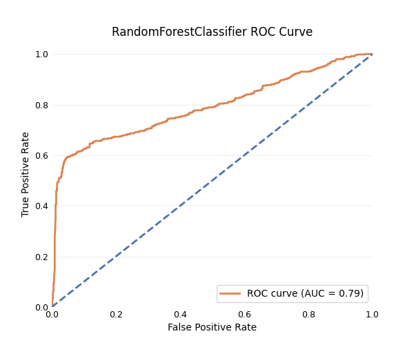
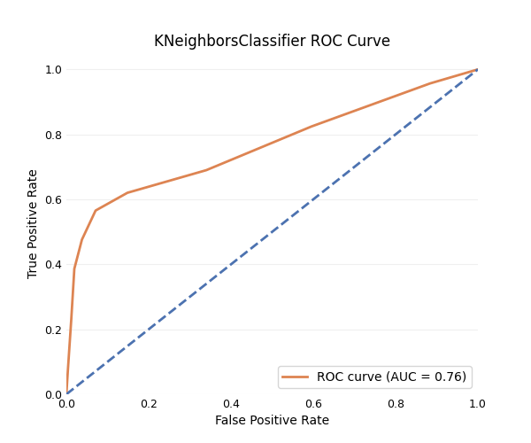
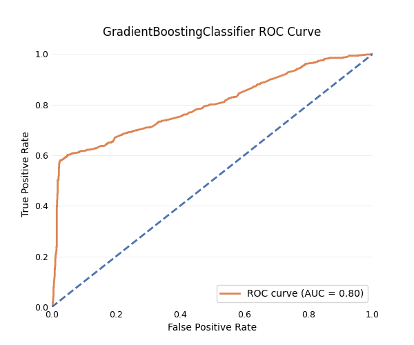
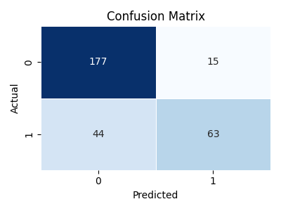

# Travel Insurance Purchase Prediction

## Dataset

The dataset for this project can be found on [Kaggle](https://www.kaggle.com/datasets/tejashvi14/travel-insurance-prediction-data) (licensed under CC0: Public Domain).

The information comprises details about customers from a travel and tours company, focusing on their purchase behavior regarding a new travel insurance package offered in 2019. It includes various demographic and behavioral features such as age, employment type, education level, annual income, family size, health conditions, frequent flyer status, and travel history. The records capture whether customers purchased the travel insurance package during its introductory offer. However, the provided description is minimal, leaving most details about data collection and preprocessing unknown.

It is unclear whether the sampling method was random, but for the purposes of this project, I will assume it was random to apply statistical inference methods.

## Objectives

The main objective of this project is:

> **Develop a binary classification model that can predict when a company client will be interested in buying travel insurance.**

I will assume that the business is interested in obtaining a higher F1 score for the positive class and use this score to evaluate the model's success. The F1 score, measures overall performance by balancing false positives and false negatives. This ensures that customers who are targeted are more likely to be interested, reducing annoyance and improving satisfaction, while also capturing a large number of potential customers.

To achieve this objective, the project was broken down into the following three sub-objectives:

1. Perform in-depth exploratory data analysis to document insights.
2. Select and tune hyperparameters and thresholds for three well-performing classification models.
3. Ensemble these models to improve overall performance.

## Insights Based on EDA

- Individuals who purchase travel insurance are more likely to be privately employed or self-employed rather than government employees.
- Having a high income is a good indicator of someone buying travel insurance.
- Frequent fliers are more inclined to buy travel insurance.
- Those who have traveled abroad before are more likely to purchase travel insurance.
- There is no statistically significant difference in travel insurance purchase behavior between graduates and non-graduates.
- The presence of a chronic disease does not show a statistically significant association with the likelihood of purchasing travel insurance.
- Age is not a statistically significant predictor for buying travel insurance.
- The number of family members is not statistically significantly related to buying travel insurance.

## Model Selection

The algorithms tested were RandomForestClassifier, SVC (Support Vector Classifier), KNeighborsClassifier, GaussianNB (Naive Bayes), GradientBoostingClassifier, and LogisticRegression. After evaluating their performance, I selected RandomForestClassifier, KNeighborsClassifier, and GradientBoostingClassifier. I then optimized hyperparameters and thresholds to enhance their F1 scores.

    
    

    

- The RandomForestClassifier was tuned with the following hyperparameters: `n_estimators=100`, `max_depth=10`, `min_samples_split=5`, `min_samples_leaf=2`, `max_features='sqrt'`, and `class_weight=None`. The best threshold for the F1 score was found to be 0.47.
- The KNeighborsClassifier was tuned with the following hyperparameters: `n_neighbors=9`, `metric='euclidean'`, `weights=None`, and `algorithm='ball_tree'`. The best threshold for the F1 score was found to be 0.56.
- The GradientBoostingClassifier was tuned with the following hyperparameters: `n_estimators=200`, `learning_rate=0.01`, `max_depth=4`, and `subsample=1.0`. The best threshold for the F1 score was found to be 0.37.

## Ensemble Performance

Final ensemble performance assessment on a holdout test dataset:

| Class       | Precision | Recall | F1-Score |
|-------------|-----------|--------|----------|
| 0           | 0.81      | 0.95   | 0.87     |
| 1           | 0.86      | 0.60   | 0.71     |
| Accuracy    |           |        | 0.82     |
| Macro Avg   | 0.84      | 0.77   | 0.79     |
| Weighted Avg| 0.83      | 0.82   | 0.81     |

The model has high precision, which could be increased further by changing the threshold. However, the model's recall is quite low, correctly classifying only about 60% of the positive class.
